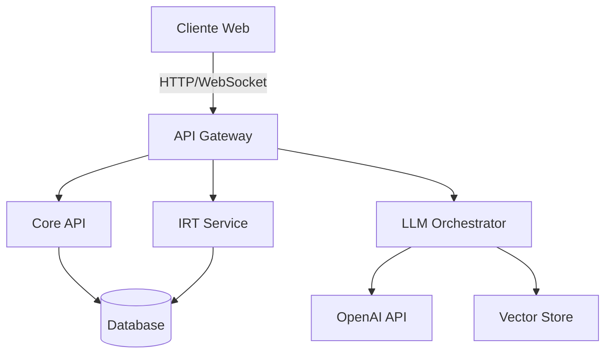

# ICFES AI Tutor 🎓

Sistema inteligente de preparación para las Pruebas Saber 11 que utiliza Item Response Theory (IRT) y modelos de lenguaje avanzados para proporcionar una experiencia de aprendizaje personalizada.

## 🌟 Características

- **Evaluación Adaptativa**: Sistema IRT que ajusta la dificultad de las preguntas en tiempo real
- **IA Especializada**: LLMs específicos para cada área del ICFES
- **Análisis Detallado**: Seguimiento de competencias y subcompetencias
- **Explicaciones Personalizadas**: Adaptadas al nivel y estilo de aprendizaje del estudiante
- **Interfaz Moderna**: UI/UX optimizada con Next.js y shadcn/ui
- **Arquitectura Escalable**: Backend en FastAPI con microservicios

## 🚀 Tecnologías

### Backend
- FastAPI (Python 3.11+)
- SQLAlchemy + Alembic
- LangChain + OpenAI
- PostgreSQL/SQLite

### Frontend
- Next.js 14+
- Tailwind CSS
- shadcn/ui
- TypeScript

## 📋 Requisitos

Ver [INSTALL.md](INSTALL.md) para instrucciones detalladas de instalación.

## 🏗️ Arquitectura

El proyecto sigue una arquitectura de microservicios moderna:

## 📚 Documentación

- [Arquitectura Técnica](icfes-ai-architecture.md)
- [Guía de Instalación](INSTALL.md)
- [API Documentation](http://localhost:8000/docs) (en desarrollo)

## 🤝 Contribuir

1. Fork el repositorio
2. Crea una rama para tu feature (`git checkout -b feature/AmazingFeature`)
3. Commit tus cambios (`git commit -m 'Add some AmazingFeature'`)
4. Push a la rama (`git push origin feature/AmazingFeature`)
5. Abre un Pull Request

## 📝 Licencia

Este proyecto está bajo la Licencia MIT - ver el archivo [LICENSE](LICENSE) para más detalles.

## ✨ Agradecimientos

- ICFES por proporcionar el marco de referencia
- OpenAI por el acceso a sus modelos
- Todos los contribuidores y estudiantes que ayudan a mejorar el proyecto 