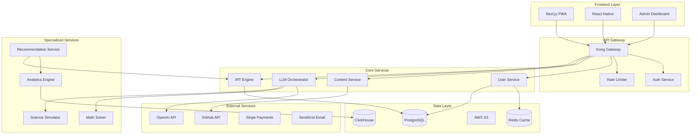

# ICFES AI Tutor - Arquitectura Técnica Mejorada con IRT y Syllabus Completo

## 1. Stack Tecnológico Actualizado

### Frontend
- **Framework**: Next.js 14+ con App Router + PWA
- **UI Components**: shadcn/ui + Tailwind CSS + Framer Motion
- **State Management**: Zustand + TanStack Query v5
- **Gráficos**: Recharts + D3.js + Manim.js para matemáticas
- **Real-time**: Socket.io + Server-Sent Events
- **Offline**: Workbox + IndexedDB con idb-keyval
- **Accesibilidad**: WCAG 2.2 AA compliant

### Backend - Arquitectura de Microservicios
```yaml
services:
  api-gateway:
    framework: Kong/AWS API Gateway
    rate-limiting: true
    auth: OAuth2 + JWT
  
  core-api:
    framework: FastAPI (Python 3.11+)
    features:
      - Async/await nativo
      - Pydantic v2 para validación
      - OpenAPI auto-documentado
  
  irt-service:
    framework: FastAPI + NumPy/SciPy
    engine: mirtCAT (R) via rpy2 o py-irt
    calibration: 2PL/3PL models
  
  llm-orchestrator:
    framework: LangChain + OpenAI API
    models:
      math: GPT-4o con Code Interpreter
      reading: Claude-3-Opus
      science: GPT-4 + función RAG
      social: Claude-3-Sonnet
      english: GPT-4 fine-tuned CEFR
  
  rag-service:
    framework: LlamaIndex + FastAPI
    embeddings: OpenAI ada-002
    reranking: Cohere rerank API
```

### Base de Datos - Arquitectura Híbrida
```sql
-- PostgreSQL (principal)
CREATE TABLE items (
    id UUID PRIMARY KEY,
    area VARCHAR(50),
    competencia VARCHAR(100),
    sub_competencia VARCHAR(200),
    contenido_especifico TEXT,
    difficulty_b FLOAT,  -- IRT parameter
    discrimination_a FLOAT,  -- IRT parameter
    guessing_c FLOAT,  -- IRT parameter
    embedding vector(1536),  -- pgvector
    metadata JSONB,
    created_at TIMESTAMP DEFAULT NOW()
);

CREATE TABLE student_responses (
    id UUID PRIMARY KEY,
    student_id UUID,
    item_id UUID,
    response TEXT,
    is_correct BOOLEAN,
    response_time_ms INTEGER,
    theta_before FLOAT,
    theta_after FLOAT,
    confidence_level FLOAT,  -- 0-100
    explanation_depth VARCHAR(50),
    timestamp TIMESTAMP DEFAULT NOW()
);

-- Índices para performance
CREATE INDEX idx_items_area_competencia ON items(area, competencia);
CREATE INDEX idx_responses_student_time ON student_responses(student_id, timestamp);
```

### Infraestructura Cloud-Native
```terraform
# AWS Infrastructure as Code
resource "aws_eks_cluster" "icfes_cluster" {
  name     = "icfes-ai-tutor"
  role_arn = aws_iam_role.eks_cluster.arn
  
  vpc_config {
    subnet_ids = aws_subnet.private[*].id
  }
}

resource "aws_rds_cluster" "postgres" {
  engine         = "aurora-postgresql"
  engine_version = "15.4"
  database_name  = "icfes_ai"
  
  serverlessv2_scaling_configuration {
    max_capacity = 16
    min_capacity = 0.5
  }
}
```

## 2. Modelo Pedagógico Basado en IRT y Competencias ICFES

### Sistema de Mapeo Competencias → Items
```python
class CompetencyMapper:
    """Mapea cada pregunta al framework exacto del ICFES"""
    
    COMPETENCY_TREE = {
        "LECTURA_CRITICA": {
            "competencias": [
                "identificar_contenidos_locales",
                "comprender_estructura_global", 
                "reflexionar_evaluar_contenido"
            ],
            "tipos_texto": ["continuo", "discontinuo", "literario", "informativo"],
            "niveles_bloom": ["recordar", "comprender", "aplicar", "analizar", "evaluar"]
        },
        "MATEMATICAS": {
            "competencias": [
                "interpretacion_representacion",
                "formulacion_ejecucion",
                "argumentacion"
            ],
            "pensamientos": ["numerico_variacional", "espacial_metrico", "aleatorio"],
            "contextos": ["personal", "laboral", "social", "cientifico"]
        },
        # Similar para CIENCIAS, SOCIALES, INGLES...
    }
    
    def tag_item(self, item_content: str, area: str) -> Dict:
        """Usa GPT-4 para auto-etiquetar items con competencias"""
        prompt = f"""
        Analiza esta pregunta del área {area} del ICFES:
        {item_content}
        
        Clasifícala según:
        1. Competencia específica evaluada
        2. Sub-competencia o tema
        3. Nivel cognitivo (Bloom)
        4. Contexto de aplicación
        
        Responde en JSON con la estructura del COMPETENCY_TREE.
        """
        
        response = openai.ChatCompletion.create(
            model="gpt-4",
            messages=[{"role": "system", "content": prompt}],
            response_format={"type": "json_object"}
        )
        
        return json.loads(response.choices[0].message.content)
```

### Motor IRT Adaptativo
```python
class AdaptiveIRTEngine:
    """Motor central de Item Response Theory"""
    
    def __init__(self):
        self.estimator = BayesianThetaEstimator()
        self.item_bank = CalibratedItemBank()
        self.knowledge_tracer = BayesianKnowledgeTracing()
    
    def estimate_ability(self, student_id: str, area: str) -> float:
        """Estima θ (habilidad) del estudiante en tiempo real"""
        responses = self.get_recent_responses(student_id, area)
        
        # Modelo 3PL: P(correct) = c + (1-c) / (1 + exp(-a(θ-b)))
        theta = self.estimator.estimate_map(
            responses=responses,
            items=self.item_bank.get_items(area),
            prior_mean=0.0,
            prior_sd=1.0
        )
        
        return theta
    
    def select_next_item(self, student_id: str, area: str, 
                        target_info: float = 0.5) -> Dict:
        """Selecciona el siguiente ítem óptimo"""
        theta = self.estimate_ability(student_id, area)
        available_items = self.item_bank.get_unused_items(student_id, area)
        
        # Maximizar información de Fisher en θ actual
        item_infos = []
        for item in available_items:
            info = self.calculate_item_information(item, theta)
            item_infos.append((item, info))
        
        # Balancear información con cobertura de competencias
        selected = self.balance_selection(
            item_infos, 
            student_competency_gaps=self.get_competency_gaps(student_id)
        )
        
        return selected
    
    def calculate_item_information(self, item: Dict, theta: float) -> float:
        """Información de Fisher para un ítem en θ dado"""
        a, b, c = item['discrimination_a'], item['difficulty_b'], item['guessing_c']
        
        # Fórmula de información para modelo 3PL
        p = c + (1 - c) / (1 + np.exp(-a * (theta - b)))
        q = 1 - p
        info = (a**2 * (p - c)**2 * q) / ((1 - c)**2 * p)
        
        return info
```

### Sistema de Explicaciones Adaptativas Mejorado
```python
class EnhancedAdaptiveExplainer:
    """Combina confidence slider con θ para explicaciones óptimas"""
    
    def __init__(self):
        self.llm_router = LLMRouter()
        self.visualization_engine = VisualizationEngine()
        self.memory = StudentMemory()  # Redis-backed
    
    def generate_explanation(self, 
                           item: Dict,
                           student_response: str,
                           is_correct: bool,
                           confidence: float,  # 0-100 del slider
                           theta: float,       # habilidad IRT
                           area: str) -> Dict:
        
        # Calcular profundidad óptima
        depth_score = self.calculate_depth_score(
            confidence=confidence,
            theta=theta,
            item_difficulty=item['difficulty_b'],
            is_correct=is_correct
        )
        
        # Obtener patrones de error previos
        error_patterns = self.memory.get_error_patterns(
            student_id=student_response['student_id'],
            competency=item['competencia']
        )
        
        # Prompt engineering específico por área
        prompt = self.build_specialized_prompt(
            area=area,
            item=item,
            depth_score=depth_score,
            error_patterns=error_patterns
        )
        
        # Enrutamiento a LLM especializado
        llm_response = self.llm_router.route(
            area=area,
            prompt=prompt,
            include_visuals=(depth_score > 0.7)
        )
        
        return {
            'explanation': llm_response['text'],
            'visuals': llm_response.get('visuals', []),
            'related_concepts': self.get_prerequisite_concepts(item),
            'practice_items': self.suggest_practice_items(theta, item),
            'confidence_feedback': self.analyze_confidence_accuracy(confidence, is_correct)
        }
    
    def calculate_depth_score(self, confidence: float, theta: float, 
                            item_difficulty: float, is_correct: bool) -> float:
        """Fórmula mejorada para profundidad de explicación"""
        
        # Factor 1: Discrepancia confidence vs resultado
        confidence_normalized = confidence / 100
        discrepancy = abs(confidence_normalized - float(is_correct))
        
        # Factor 2: Distancia entre habilidad y dificultad
        ability_gap = abs(theta - item_difficulty)
        
        # Factor 3: Historial de errores en esta competencia
        error_rate = self.memory.get_error_rate(competency=item['competencia'])
        
        # Fórmula ponderada
        depth = (
            0.3 * discrepancy +      # Peso a la sorpresa
            0.4 * (1 - confidence_normalized) +  # Peso a baja confianza
            0.2 * min(ability_gap / 3, 1) +     # Peso a la dificultad relativa
            0.1 * error_rate                     # Peso al historial
        )
        
        return np.clip(depth, 0, 1)
```

## 3. Arquitectura de LLMs Especializados con OpenAI

### Orquestador Principal con APIs de OpenAI
```python
class OpenAILLMOrchestrator:
    """Gestiona múltiples modelos especializados via OpenAI API"""
    
    def __init__(self):
        openai.api_key = os.getenv("OPENAI_API_KEY")
        self.github_integration = GitHubContentManager()
        
        self.model_config = {
            'lectura_critica': {
                'model': 'gpt-4-turbo-preview',
                'temperature': 0.3,
                'system_prompt': self.load_prompt('lectura_critica_system.md')
            },
            'matematicas': {
                'model': 'gpt-4-code-interpreter',
                'temperature': 0.1,
                'plugins': ['wolfram', 'sympy_executor'],
                'system_prompt': self.load_prompt('matematicas_system.md')
            },
            'ciencias': {
                'model': 'gpt-4',
                'temperature': 0.2,
                'tools': ['molecule_visualizer', 'physics_simulator'],
                'system_prompt': self.load_prompt('ciencias_system.md')
            },
            'sociales': {
                'model': 'gpt-4',
                'temperature': 0.4,
                'context_injection': 'constitucion_colombia.json',
                'system_prompt': self.load_prompt('sociales_system.md')
            },
            'ingles': {
                'model': 'gpt-3.5-turbo-16k',
                'temperature': 0.2,
                'fine_tuned_model': 'ft:gpt-3.5-turbo:icfes-english:7n8m9p0q',
                'system_prompt': self.load_prompt('ingles_cefr_system.md')
            }
        }
    
    async def process_question(self, area: str, question: Dict, 
                             student_context: Dict) -> Dict:
        """Procesa una pregunta con el modelo especializado"""
        
        config = self.model_config[area]
        
        # Construir messages con contexto
        messages = [
            {"role": "system", "content": config['system_prompt']},
            {"role": "user", "content": self.build_question_prompt(
                question=question,
                student_context=student_context,
                include_competencies=True
            )}
        ]
        
        # Añadir herramientas específicas
        tools = None
        if area == 'matematicas':
            tools = self.get_math_tools()
        elif area == 'ciencias':
            tools = self.get_science_tools()
        
        # Llamada a OpenAI
        response = await openai.ChatCompletion.acreate(
            model=config.get('fine_tuned_model', config['model']),
            messages=messages,
            temperature=config['temperature'],
            tools=tools,
            tool_choice="auto" if tools else None,
            response_format={"type": "json_object"}
        )
        
        # Procesar y estructurar respuesta
        return self.structure_response(
            raw_response=response,
            area=area,
            question=question
        )
```

### Motor Matemático Avanzado
```python
class MathEngineGPT4:
    """Motor matemático usando GPT-4 Code Interpreter + SymPy"""
    
    def __init__(self):
        self.code_interpreter = CodeInterpreterSession()
        self.manim_renderer = ManimRenderer()
        self.sympy_kernel = SymPyKernel()
    
    async def solve_and_explain(self, problem: str, theta: float, 
                              confidence: float) -> Dict:
        
        # Paso 1: Análisis simbólico con Code Interpreter
        analysis = await self.code_interpreter.run(f"""
        import sympy as sp
        import numpy as np
        import matplotlib.pyplot as plt
        
        # Analizar el problema
        {problem}
        
        # Resolver paso a paso
        # Mostrar trabajo algebraico
        # Generar visualizaciones si aplica
        """)
        
        # Paso 2: Generar explicación adaptativa
        explanation_prompt = f"""
        Problema: {problem}
        Solución: {analysis['solution']}
        Nivel de detalle requerido: {self.calculate_detail_level(theta, confidence)}
        
        Genera una explicación que:
        1. {"Muestre CADA paso algebraico" if confidence < 30 else "Resalte pasos clave"}
        2. {"Explique conceptos básicos" if theta < -0.5 else "Asuma conocimientos previos"}
        3. {"Incluya errores comunes" if confidence < 50 else "Sea concisa"}
        4. Conecte con el contexto ICFES de la competencia evaluada
        """
        
        explanation = await openai.ChatCompletion.acreate(
            model="gpt-4",
            messages=[
                {"role": "system", "content": "Eres un tutor experto en matemáticas ICFES."},
                {"role": "user", "content": explanation_prompt}
            ]
        )
        
        # Paso 3: Visualización con Manim si es necesario
        visuals = []
        if self.needs_visualization(problem, theta):
            manim_code = await self.generate_manim_code(problem, analysis)
            visual_url = await self.manim_renderer.render(manim_code)
            visuals.append(visual_url)
        
        return {
            'solution': analysis['solution'],
            'explanation': explanation.choices[0].message.content,
            'step_by_step': analysis['steps'],
            'visuals': visuals,
            'similar_problems': await self.generate_similar_problems(problem, theta),
            'competency_alignment': self.map_to_icfes_competency(problem)
        }
```

## 4. Sistema de Datos y Analytics con GitHub Integration

### Versionado de Contenido con GitHub
```python
class GitHubContentVersioning:
    """Gestiona el banco de preguntas versionado en GitHub"""
    
    def __init__(self):
        self.github = Github(os.getenv("GITHUB_TOKEN"))
        self.repo = self.github.get_repo("icfes-ai-tutor/question-bank")
        
    async def add_question(self, question: Dict, reviewer: str) -> str:
        """Añade pregunta via PR con review process"""
        
        # Crear branch
        branch_name = f"add-question-{question['area']}-{uuid.uuid4().hex[:8]}"
        base = self.repo.get_branch("main")
        self.repo.create_git_ref(f"refs/heads/{branch_name}", base.commit.sha)
        
        # Validar con GPT-4
        validation = await self.validate_question_quality(question)
        
        # Crear archivo
        content = {
            **question,
            'validation': validation,
            'irt_params': await self.estimate_initial_irt_params(question),
            'metadata': {
                'created_by': reviewer,
                'created_at': datetime.now().isoformat(),
                'syllabus_alignment': self.check_syllabus_alignment(question)
            }
        }
        
        file_path = f"questions/{question['area']}/{question['competencia']}/{uuid.uuid4()}.json"
        self.repo.create_file(
            file_path,
            f"Add question for {question['competencia']}",
            json.dumps(content, indent=2),
            branch=branch_name
        )
        
        # Crear PR
        pr = self.repo.create_pull(
            title=f"Nueva pregunta: {question['area']} - {question['competencia']}",
            body=self.generate_pr_description(question, validation),
            head=branch_name,
            base="main"
        )
        
        # Auto-assign reviewers
        pr.create_review_request(reviewers=[reviewer, "pedagogy-team"])
        
        return pr.html_url
```

### Analytics y Métricas en Tiempo Real
```python
class RealTimeAnalytics:
    """Sistema de analytics con ClickHouse y Grafana"""
    
    def __init__(self):
        self.clickhouse = ClickHouseClient()
        self.redis = redis.Redis()
        self.ml_pipeline = MLPipeline()
    
    async def track_learning_event(self, event: Dict):
        """Registra evento de aprendizaje en tiempo real"""
        
        # Enriquecer evento
        enriched = {
            **event,
            'theta_current': await self.get_current_theta(event['student_id']),
            'competency_mastery': await self.calculate_mastery_level(
                event['student_id'], 
                event['competency']
            ),
            'predicted_icfes_score': await self.predict_score(event['student_id']),
            'timestamp': datetime.now()
        }
        
        # Stream a ClickHouse
        await self.clickhouse.insert('learning_events', enriched)
        
        # Update real-time dashboard
        await self.update_dashboard_metrics(enriched)
        
        # Trigger adaptive actions if needed
        if enriched['competency_mastery'] < 0.3:
            await self.trigger_intervention(event['student_id'], event['competency'])
    
    def generate_weekly_insights(self, student_id: str) -> Dict:
        """Genera insights semanales personalizados"""
        
        query = """
        SELECT 
            area,
            competencia,
            AVG(theta_after - theta_before) as theta_gain,
            COUNT(*) as practice_count,
            AVG(response_time_ms) as avg_time,
            AVG(CASE WHEN is_correct THEN 1 ELSE 0 END) as accuracy,
            groupArray(error_patterns) as common_errors
        FROM learning_events
        WHERE student_id = %(student_id)s
            AND timestamp > now() - INTERVAL 7 DAY
        GROUP BY area, competencia
        """
        
        results = self.clickhouse.query(query, {'student_id': student_id})
        
        # ML insights
        insights = {
            'performance_summary': results,
            'predicted_improvement': self.ml_pipeline.predict_improvement(results),
            'recommended_focus_areas': self.identify_focus_areas(results),
            'study_time_optimization': self.optimize_study_schedule(results),
            'peer_comparison': self.anonymous_peer_ranking(student_id, results)
        }
        
        return insights
```

## 5. Características Innovadoras Mejoradas

### Sistema de Competencias Gamificado con Blockchain
```python
class CompetencyNFTSystem:
    """NFTs educativos para logros verificables"""
    
    def __init__(self):
        self.web3 = Web3(Web3.HTTPProvider(os.getenv("POLYGON_RPC")))
        self.contract = self.load_achievement_contract()
    
    async def mint_competency_badge(self, student_id: str, achievement: Dict):
        """Mint NFT cuando se domina una competencia"""
        
        if achievement['mastery_level'] >= 0.8:
            metadata = {
                'student_id_hash': hashlib.sha256(student_id.encode()).hexdigest(),
                'competency': achievement['competency'],
                'area': achievement['area'],
                'theta_achieved': achievement['theta'],
                'date': datetime.now().isoformat(),
                'issuer': 'ICFES AI Tutor',
                'evidence_url': f"https://api.icfes-ai.co/evidence/{achievement['id']}"
            }
            
            # Mint en Polygon (low gas)
            tx = await self.contract.mintAchievement(
                to=self.get_wallet_address(student_id),
                metadata_uri=self.upload_to_ipfs(metadata)
            )
            
            return {
                'transaction_hash': tx.hash,
                'opensea_url': f"https://opensea.io/assets/matic/{self.contract.address}/{tx.token_id}",
                'share_url': self.generate_share_url(achievement)
            }
```

### Modo Colaborativo con Video en Tiempo Real
```python
class CollaborativeStudyRooms:
    """Salas de estudio con IA moderadora"""
    
    def __init__(self):
        self.agora_rtc = AgoraRTC()  # Video calls
        self.ai_moderator = StudyAIModerator()
    
    async def create_study_session(self, topic: str, participants: List[str]):
        """Crea sesión de estudio colaborativa"""
        
        room = {
            'id': str(uuid.uuid4()),
            'topic': topic,
            'participants': participants,
            'ai_moderator': {
                'personality': 'encouraging_teacher',
                'knowledge_base': await self.load_topic_knowledge(topic),
                'intervention_threshold': 0.7  # Interviene si detecta confusión
            }
        }
        
        # IA observa y participa
        async def ai_monitor():
            while room['active']:
                transcript = await self.get_room_transcript(room['id'])
                
                # Detectar momentos de enseñanza
                if await self.ai_moderator.should_intervene(transcript):
                    intervention = await self.ai_moderator.generate_intervention(
                        transcript=transcript,
                        topic=topic,
                        participant_profiles=await self.get_profiles(participants)
                    )
                    
                    await self.send_ai_message(room['id'], intervention)
                
                await asyncio.sleep(10)  # Check every 10s
        
        asyncio.create_task(ai_monitor())
        
        return room
```

### Realidad Aumentada Simplificada para Ciencias
```python
class ARScienceExperiments:
    """Experimentos AR usando WebXR"""
    
    def __init__(self):
        self.model_library = ModelLibrary()  # GLB/USDZ models
        self.physics_engine = CannonJS()
        
    def generate_ar_experiment(self, concept: str, difficulty: float) -> Dict:
        """Genera experimento AR adaptado al nivel"""
        
        experiments = {
            'physics_pendulum': {
                'model': 'pendulum.glb',
                'interactions': ['change_length', 'change_mass', 'measure_period'],
                'physics_params': {
                    'gravity': 9.8,
                    'damping': 0.01 if difficulty > 0.5 else 0
                },
                'learning_objectives': [
                    'Comprender relación período-longitud',
                    'Verificar independencia de la masa',
                    'Aplicar conservación de energía'
                ]
            },
            'chemistry_molecules': {
                'model': 'molecule_kit.glb',
                'interactions': ['build_molecule', 'rotate_3d', 'identify_bonds'],
                'molecules': self.get_molecules_by_difficulty(difficulty),
                'learning_objectives': [
                    'Identificar geometría molecular',
                    'Comprender enlaces químicos',
                    'Predecir propiedades'
                ]
            }
        }
        
        return {
            'experiment': experiments.get(concept),
            'ar_viewer_url': f"https://ar.icfes-ai.co/view/{concept}",
            'fallback_video': f"https://videos.icfes-ai.co/{concept}.mp4",
            'assessment_questions': self.generate_ar_questions(concept, difficulty)
        }
```

## 6. Seguridad y Compliance Mejorado

### Protección de Datos con Cumplimiento Legal
```python
class DataProtectionCompliance:
    """Cumplimiento de Ley 1581/2012 y COPPA"""
    
    def __init__(self):
        self.encryption = AES256GCM()
        self.consent_manager = ConsentManager()
        self.audit_logger = AuditLogger()
    
    async def handle_minor_registration(self, student_data: Dict) -> Dict:
        """Registro seguro de menores con verificación parental"""
        
        # Verificar edad
        age = self.calculate_age(student_data['birth_date'])
        
        if age < 18:
            # Generar token de verificación parental
            parent_token = self.generate_secure_token()
            
            # Enviar email/SMS al acudiente
            await self.notify_parent(
                parent_email=student_data['parent_email'],
                verification_url=f"https://icfes-ai.co/verify-parent/{parent_token}",
                student_name=student_data['name']
            )
            
            # Crear cuenta provisional
            provisional_account = {
                'student_id': str(uuid.uuid4()),
                'status': 'pending_parental_consent',
                'data_retention': 'minimal',  # Solo datos esenciales
                'features_enabled': ['demo_mode'],  # Funcionalidad limitada
                'expires_at': datetime.now() + timedelta(days=7)
            }
            
            # Log para auditoría
            await self.audit_logger.log({
                'event': 'minor_registration_initiated',
                'student_id': provisional_account['student_id'],
                'age': age,
                'ip_address': self.hash_ip(student_data['ip']),
                'timestamp': datetime.now()
            })
            
            return provisional_account
        
        return await self.standard_registration(student_data)
    
    def encrypt_sensitive_data(self, data: Dict) -> Dict:
        """Cifrado selectivo de campos sensibles"""
        
        sensitive_fields = ['full_name', 'email', 'phone', 'address', 'school']
        encrypted = data.copy()
        
        for field in sensitive_fields:
            if field in data:
                encrypted[field] = self.encryption.encrypt(
                    data[field],
                    additional_data=data.get('student_id', '')
                )
        
        return encrypted
```

## 7. Modelo de Negocio y Monetización Actualizado

### Pricing Dinámico con ML
```python
class DynamicPricingEngine:
    """Precios personalizados para maximizar acceso e ingresos"""
    
    def __init__(self):
        self.ml_model = load_model('pricing_elasticity_model.pkl')
        self.ab_test_framework = Optimizely()
    
    def calculate_optimal_price(self, user_profile: Dict) -> Dict:
        """Calcula precio óptimo basado en múltiples factores"""
        
        features = {
            'region': user_profile['location']['department'],
            'school_type': user_profile['school']['type'],  # público/privado
            'socioeconomic_stratum': user_profile.get('stratum', 3),
            'days_to_exam': self.calculate_days_to_icfes(),
            'current_performance': user_profile.get('initial_diagnostic_score', 250),
            'engagement_score': user_profile.get('engagement', 0.5)
        }
        
        # Precio base
        base_price = 15000  # COP
        
        # Ajustes por ML
        price_multiplier = self.ml_model.predict(features)[0]
        
        # Descuentos especiales
        discounts = []
        if user_profile['school']['type'] == 'public':
            discounts.append({'type': 'public_school', 'percent': 40})
        
        if features['socioeconomic_stratum'] <= 2:
            discounts.append({'type': 'low_income', 'percent': 50})
        
        if features['days_to_exam'] > 90:
            discounts.append({'type': 'early_bird', 'percent': 20})
        
        # Calcular precio final
        final_price = base_price * price_multiplier
        total_discount = sum(d['percent'] for d in discounts)
        final_price *= (1 - total_discount / 100)
        
        return {
            'original_price': base_price,
            'recommended_price': int(final_price),
            'applied_discounts': discounts,
            'payment_options': self.generate_payment_plans(final_price),
            'conversion_probability': self.estimate_conversion_prob(features, final_price)
        }
```

### Modelo B2B para Instituciones
```python
class InstitutionalSalesEngine:
    """Ventas y soporte para colegios"""
    
    def __init__(self):
        self.crm = HubspotClient()
        self.analytics = InstitutionalAnalytics()
    
    async def generate_school_proposal(self, school_id: str) -> Dict:
        """Genera propuesta personalizada para colegio"""
        
        school_data = await self.get_school_profile(school_id)
        
        # Análisis de necesidades
        needs_analysis = {
            'student_count': school_data['total_students_grade_11'],
            'historical_icfes_performance': await self.get_historical_scores(school_id),
            'identified_gaps': await self.analyze_competency_gaps(school_id),
            'projected_improvement': await self.ml_predict_improvement(school_data)
        }
        
        # Pricing por volumen
        volume_price = self.calculate_volume_discount(
            students=needs_analysis['student_count'],
            base_price_per_student=8000  # COP
        )
        
        # Generar propuesta
        proposal = {
            'executive_summary': await self.generate_executive_summary(needs_analysis),
            'solution_overview': {
                'platform_features': self.get_institutional_features(),
                'teacher_dashboard': True,
                'parent_portal': True,
                'custom_branding': True,
                'dedicated_support': True
            },
            'implementation_plan': {
                'phase1': 'Diagnóstico inicial (Semana 1-2)',
                'phase2': 'Capacitación docentes (Semana 3)',
                'phase3': 'Lanzamiento estudiantes (Semana 4)',
                'phase4': 'Monitoreo y ajustes (Ongoing)'
            },
            'pricing': {
                'total_investment': volume_price['total'],
                'per_student_cost': volume_price['per_student'],
                'roi_projection': needs_analysis['projected_improvement'],
                'payment_terms': 'Net 30, pagos mensuales disponibles'
            },
            'success_metrics': {
                'kpi_1': 'Incremento promedio puntaje ICFES: +35 puntos',
                'kpi_2': 'Tasa de uso diario: >70%',
                'kpi_3': 'Satisfacción docente: >85%'
            }
        }
        
        # Guardar en CRM
        await self.crm.create_deal({
            'school': school_id,
            'proposal': proposal,
            'stage': 'Proposal Sent',
            'value': volume_price['total']
        })
        
        return proposal
```

## 8. Roadmap Técnico Detallado (12 meses)

### Fase 1: Foundation (Meses 1-3)
```yaml
Sprint 1-2:
  - Setup infraestructura AWS EKS
  - Implementar PostgreSQL + pgvector
  - API Gateway con rate limiting
  - Sistema de autenticación OAuth2
  - CI/CD con GitHub Actions

Sprint 3-4:
  - Desarrollo IRT engine básico
  - Integración OpenAI GPT-4 para 3 áreas
  - Banco inicial 1000 preguntas calibradas
  - Frontend Next.js con diseño responsive

Sprint 5-6:
  - Sistema de diagnóstico inicial
  - Explicaciones adaptativas v1
  - Analytics básicos con ClickHouse
  - Testing con 100 estudiantes piloto

Métricas objetivo:
  - Cobertura de tests: >80%
  - Tiempo de respuesta API: <500ms p95
  - NPS estudiantes piloto: >60
```

### Fase 2: Enhancement (Meses 4-6)
```yaml
Sprint 7-8:
  - Implementar Bayesian Knowledge Tracing
  - Spaced repetition algorithm
  - RAG con todos los textos ICFES
  - Fine-tuning modelos por área

Sprint 9-10:
  - Teacher dashboard completo
  - Parent portal con reportes
  - Modo offline con sync
  - Gamificación básica (badges, streaks)

Sprint 11-12:
  - A/B testing framework
  - Recommendation engine v1
  - Video explicativos con Synthesia
  - Integración con 10 colegios piloto

Métricas objetivo:
  - Mejora θ promedio: +0.5σ
  - Retención 30 días: >65%
  - Precisión predicciones: >85%
```

### Fase 3: Scale (Meses 7-9)
```yaml
Sprint 13-14:
  - Modo batalla multiplayer
  - AR experiments para ciencias
  - AI Study Buddy con personalidad
  - 5000+ preguntas calibradas

Sprint 15-16:
  - ML fairness pipeline
  - Auto-scaling optimizado
  - CDN Colombia + cache edge
  - Institutional B2B features

Sprint 17-18:
  - Blockchain achievements
  - Advanced analytics ML
  - API pública para developers
  - Expansión a 100 colegios

Métricas objetivo:
  - MAU: 50,000+
  - Churn rate: <10% mensual
  - ARPU: $12,000 COP
```

### Fase 4: Excellence (Meses 10-12)
```yaml
Sprint 19-20:
  - ISO 27001 compliance
  - SOC 2 Type II audit
  - Advanced ML predictions
  - White-label solution

Sprint 21-22:
  - AI content generation
  - Peer tutoring marketplace
  - University partnerships
  - Regional expansion prep

Sprint 23-24:
  - Performance optimization
  - Cost optimization (30% reduction)
  - Advanced features launch
  - Series A preparation

Métricas objetivo:
  - Estudiantes activos: 100,000+
  - Mejora ICFES promedio: +40 puntos
  - Revenue: $150M COP/mes
  - Cobertura: 15+ departamentos
```

## 9. Arquitectura de Microservicios Detallada



## 10. Conclusión y Diferenciadores Clave

Esta arquitectura mejorada incorpora:

1. **IRT Científico**: Medición precisa de habilidades con teoría psicométrica probada
2. **Personalización Multi-dimensional**: Confidence + θ + error patterns + learning style
3. **Integración Profunda con Syllabus ICFES**: Cada pregunta mapeada a competencias específicas
4. **LLMs Especializados**: Modelos optimizados por área con herramientas específicas
5. **Analytics Accionables**: Desde métricas de negocio hasta insights pedagógicos
6. **Escalabilidad Probada**: Arquitectura cloud-native con mejores prácticas
7. **Cumplimiento Legal**: Protección de menores y datos sensibles
8. **Modelo de Negocio Sostenible**: B2C + B2B con pricing dinámico

El sistema no solo prepara para el ICFES, sino que **transforma la experiencia de aprendizaje** con tecnología de punta, midiendo y mejorando continuamente el progreso de cada estudiante.